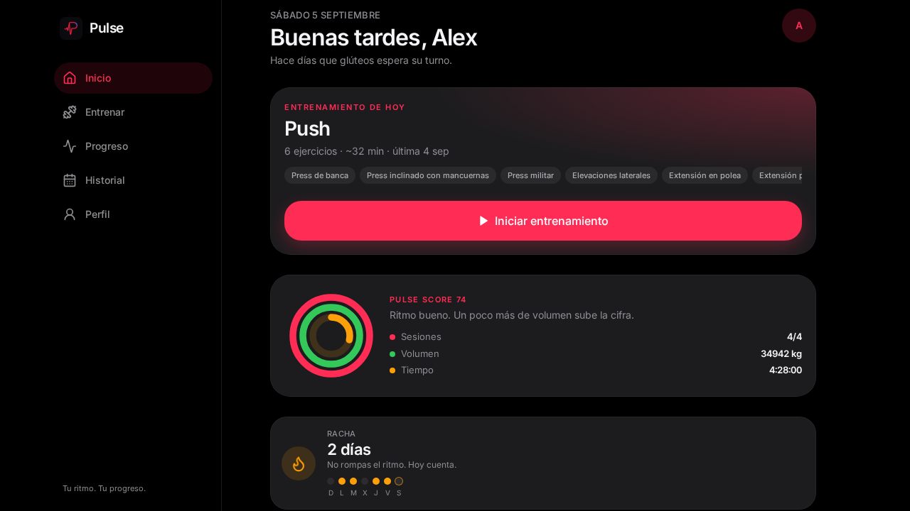
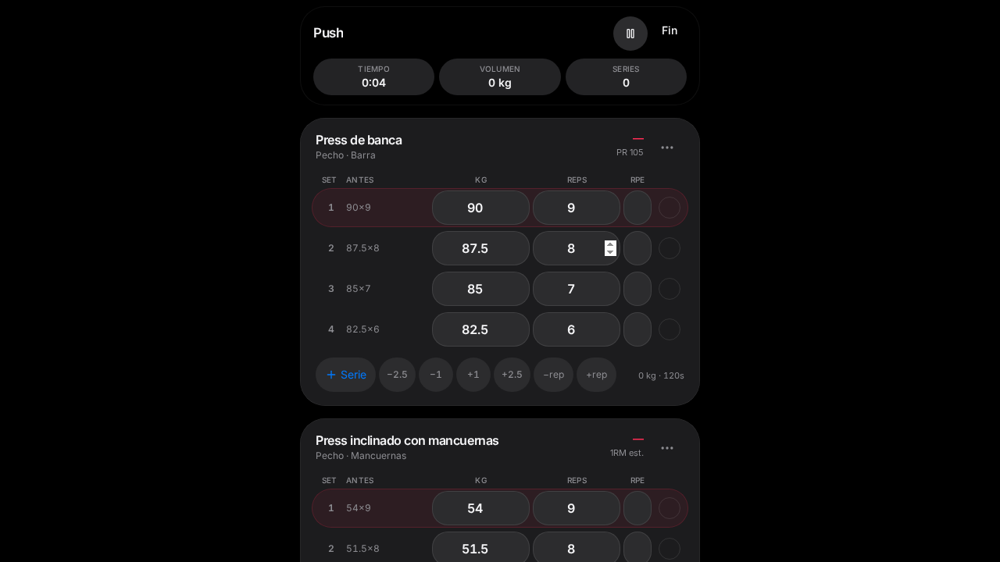
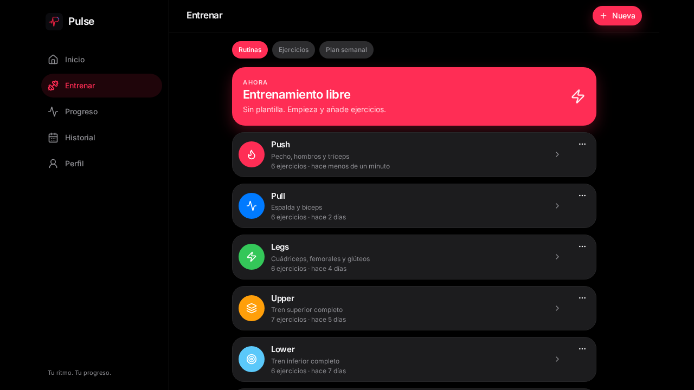

# Pulse

<p align="center">
  
</p>

Tracker de entrenamientos con el pulso de iOS: series en vivo, PRs, racha y un Pulse Score que resume la semana.








## Stack

- TanStack Start + React 19 + TypeScript
- Tailwind CSS v4 + Radix UI
- Framer Motion + dnd-kit
- Postgres (Neon en producción, PGLite en preview). Cualquier Postgres 15+, incluido el de un proyecto Supabase, funciona como `DATABASE_URL`.
- Better Auth (email/password; Google/X vía broker en deploy de Grok)
- Recharts, Zod, Sonner

Pulse **no** usa el cliente JS de Supabase ni RLS del navegador. El navegador habla solo con las server functions; Postgres se consulta en el servidor, siempre filtrado por el `user_id` de la sesión.

## Funciones

- Onboarding iOS (3 pantallas + perfil con IMC y Mifflin–St Jeor)
- Dashboard: sesión de hoy, volumen, grupos musculares, PRs, racha, Pulse Score
- Rutinas PPL / Upper-Lower / Full Body / Torso-Pierna, drag & drop, compartir
- Biblioteca de 200+ ejercicios, favoritos, historial y 1RM Epley
- Entrenamiento en vivo con timer circular, pesos de la última sesión, discos y celebración
- Historial, progreso corporal, heatmap, fotos, logros y feed social

## Local

```bash
npm install
cp .env.example .env.local   # opcional en local: sin DATABASE_URL usa PGLite
npm run dev
```

La primera cuenta genera rutinas y un historial de demostración en la base de datos.

## Deploy (Vercel)

1. Crea un Postgres (Neon, o Project Settings → Database → URI en Supabase).
2. En Vercel, define estas variables:

| Variable | Obligatoria | Qué es |
|---|---|---|
| `DATABASE_URL` | sí | Connection string Postgres (`sslmode=require`) |
| `BETTER_AUTH_SECRET` | sí | `openssl rand -hex 32` |
| `BETTER_AUTH_URL` | sí | Origen público, sin barra final. Ej: `https://pulse.vercel.app` |
| `VITE_AUTH_ENABLED` | sí | `true` |

3. El build aplica las migraciones solo:

```bash
npm run build
```

Equivale a `vite build` + `npm run db:migrate`. Si preferes ejecutar el SQL a mano (SQL Editor de Supabase), corre en este orden:

- `migrations/0001_auth.sql`
- `migrations/0002_pulse.sql`
- `migrations/0003_set_kind.sql`
- `migrations/0004_pulse_v2.sql`

No hace falta ninguna `SUPABASE_ANON_KEY` ni `sb_secret`. No las añadas: el cliente no las usa y una service role en el navegador sería un agujero de seguridad.

## Tests

```bash
npm test
```

Cubre 1RM (Epley), IMC, Mifflin–St Jeor, Pulse Score, consistencia y la calculadora de discos.
